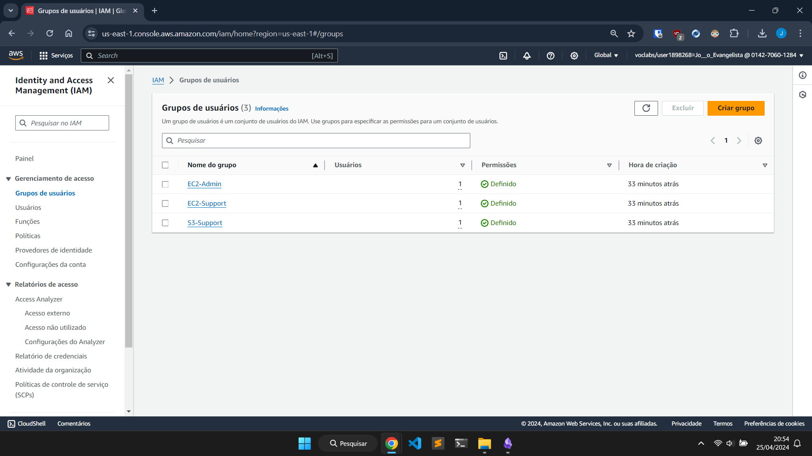
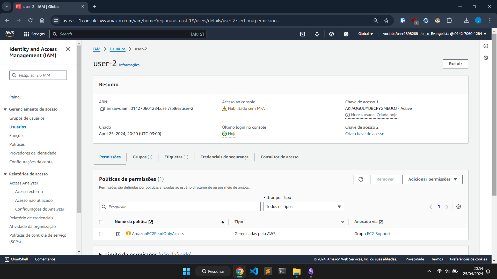
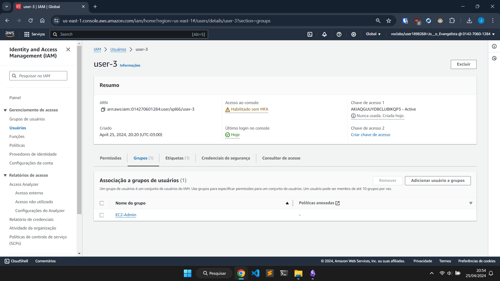
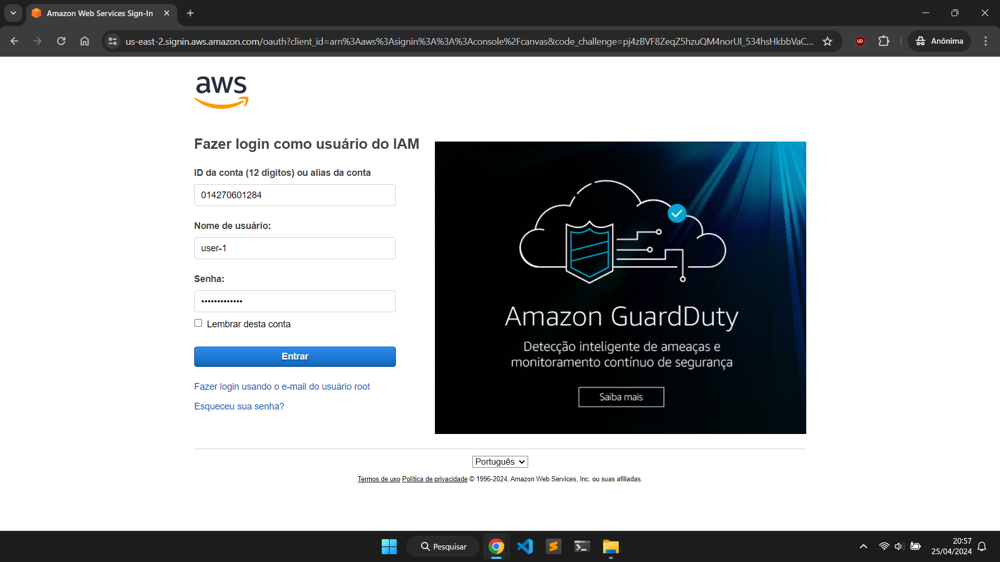

# Atividade 05

## Módulo 4 - Segurança na nuvem

## Questão 01 - 2,0 Pontos
Resolva o Teste de Conhecimento do **Módulo 4 - Segurança na nuvem**. Se você tirar 80 pontos no Teste de Conhecimento, receberá 0,8 * 2 = 1,6 pontos nesta questão.

## Questão 02 - 2,0 Pontos
Complete todas as etapas do **Laboratório 1 - Introdução ao IAM**.

Este é o primeiro laboratório, tem vários detalhes e alguns pontos estão desatualizados. Então sugiro que vocês executem com muita atenção. Por envolver o uso da interface web, é um pouco complicado tirar dúvidas por e-mail. Portanto, façam o que for possível e deixaremos para tirar dúvidas em sala de aula. Óbvio que se você conseguir realizar tudo com sucesso, estará tudo bem.

## Relatório - Laboratório 1: Introdução ao IAM

O **AWS Identity and Access Management (AWS IAM)** é um serviço da web que possibilita a clientes da Amazon Web Services (AWS) gerenciar usuários e permissões de usuário na AWS. Com o IAM, você pode gerenciar de forma centralizada os **usuários**, as **credenciais de segurança** (como as chaves de acesso) e as **permissões** que controlam quais recursos da AWS os usuários podem acessar.

## Visão geral e objetivos do laboratório

Este laboratório demonstrará como:

- Como explorar **usuários e grupos do IAM** pré-criados.
- Como inspecionar **políticas do IAM**, conforme aplicadas aos grupos pré-criados.
- Como seguir um **cenário real** adicionando usuários a grupos com recursos específicos ativados.
- Como localizar e usar a **URL de login do IAM**.
- Como **testar** os efeitos das políticas no acesso ao serviço.

## Tarefa 1: Explorar usuários e grupos

Nesta tarefa, você explorará os usuários e grupos que foram criados para você no IAM.

Abaixo está imagens do resultado seguindo os passos fornecidos pelo lab.

**Acessando o serviço IAM e exibindo os usuários criados.**

Os usuários não tinham permissões e não estavam em nenhum grupo.

**Acessando grupos de usuários**

Nessa etapa era para ver as permissões e política de cada grupo, esse _print_ foi tirado depois que eu adicionei os usuários em seus respectivos grupos por isso na coluna **Usuários** tem 1 para cada grupo, é o que vai ser feito na próxima tarefa.

## Tarefa 2: Adicionar usuários a grupos

Aqui adicionei cada usuário em seus respectivos grupos de acordo com o Cenário de negócios fornecido.

**Adicionando user-1 ao grupo S3-Support**

**Adicionando user-2 ao grupo EC2-Support**

**Adicionando user-3 ao grupo EC2-Admin**

## Tarefa 3: Fazer login e testar usuários

Nesta tarefa, testei as permissões de cada usuário do IAM.

**Fazendo login com o user-1**

**Acessando o serviço S3 e navegando pelo os buckets**

Como o user-1 faz parte do grupo S3-Support ele consegue acessar o bucket.

**Testando se o usuário consegue acessar o Amazon EC2**

Como o user-1 não faz parte do grupo EC2-Support ele não consegue acessar a instância.

Agora os próximos passos seguiram o mesmo raciocínio do anterior fazer login com usuário criado, acessar o serviço que ela está incluso por conta do grupo que ele pertence e testar o acesso em outros serviços que ele não tem permissão.

**Fazendo login com o user-2**

**Acessando o serviço EC2**

**Tentando interromper a instância LabHost**

**Testando o acesso ao serviço S3**

**Fazendo login com o user-3**

**Interrompendo a instância LabHost**

Laboratório 1 concluído.